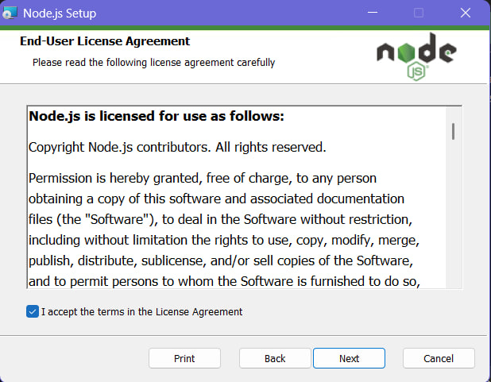
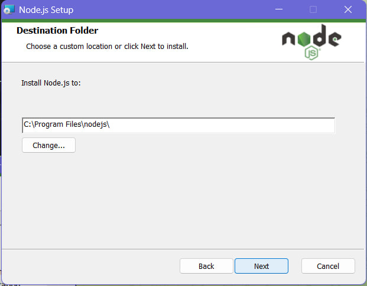
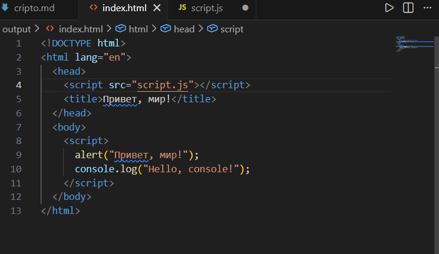

## *Лабораторная работа N1.Введение в JavaScript*

## Цель работы
###### Познакомиться с основами JavaScript, научиться писать и выполнять код в браузере и в локальной среде, разобраться с базовыми конструкциями языка.

Установите текстовый редактор (например, VS Code).
Установите Node.js с официального сайта.
Откройте DevTools в браузере (нажмите F12 и выберите вкладку Консоль).




Выполнение кода JavaScript в браузере

Откройте консоль разработчика (F12 → Console).
Напишите команду console.log("Hello, world!"); и нажмите Enter.
 Запишите в консоли 2 + 3 и посмотрите результат.


Создайте файл index.html и вставьте в него следующий код.

Создайте файл index.html и вставьте в него следующий код.

```html
<!DOCTYPE html>
<html lang="en">
 <head>
   <title>Привет, мир!</title>
 </head>
 <body>
   <script>
     alert("Привет, мир!");
     console.log("Hello, console!");
   </script>
 </body>
</html>
```


Объявление переменных и работа с типами данных.

В файле script.js создайте несколько переменных:
name - строка с вашим именем.
birthYear - число, представляющее год вашего рождения.
isStudent - логическая переменная, указывающая, являетесь ли вы студентом.

Выведите их в консоль.
Управление потоком выполнения (условия и циклы)

Добавьте следующий код в script.js:
```javascript
let name = "Валерий";      
let birthYear = 2005;         
let isStudent = true;
let score = prompt("Введите ваш балл:");
if (score >= 90) {
 console.log("Отлично!");
} else if (score >= 70) {
 console.log("Хорошо");
} else {
 console.log("Можно лучше!");
}

for (let i = 1; i <= 5; i++) {
 console.log(`Итерация: ${i}`);
}
```

В ходе выполнения лабораторной работы были изучены основы языка JavaScript. Установлено необходимое программное обеспечение: текстовый редактор VS Code и среда выполнения Node.js. Освоена работа с инструментами разработчика в браузере (консоль DevTools), выполнены базовые команды console.log() и арифметические операции. Создан HTML-документ, подключающий JavaScript, что позволило наглядно увидеть взаимодействие скрипта с веб-страницей (alert, вывод в консоль). Рассмотрены способы объявления переменных с помощью let и const, а также базовые типы данных (строка, число, логический тип). Применены управляющие конструкции: условный оператор if-else и цикл for, выполнено взаимодействие с пользователем через prompt. Полученные знания являются фундаментом для дальнейшего изучения JavaScript и разработки интерактивных веб-приложений.